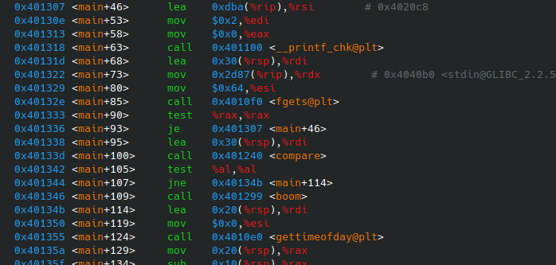
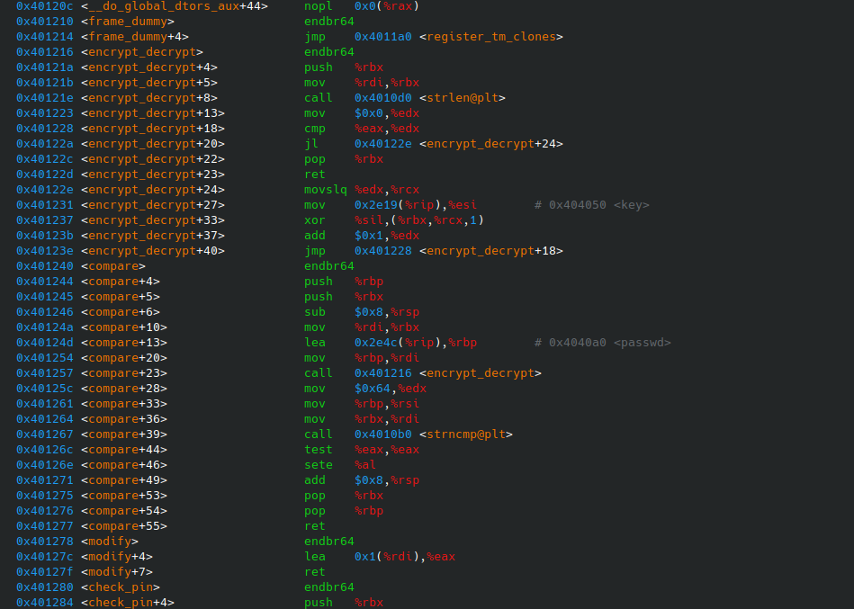
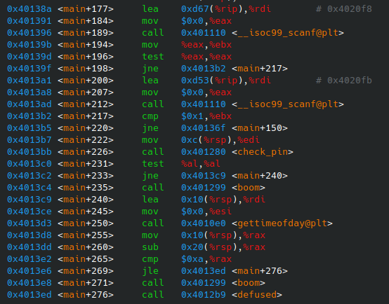
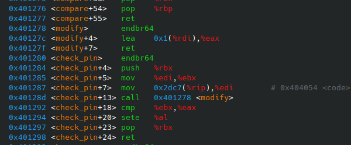

# Estructura de Computadores. Práctica 4.

**Autor:** Pablo Díaz Madera
- **Asignatura:** Estructura de Computadores.
- **Curso Académico:** 2024-25.
- **Grado:** Doble Grado en Ingeniería Informática y Matemáticas.
- **Grupo:** Único.
- **Profesor:** Ignacio Rojas Ruiz.
- **Descripción:** Práctica 4 de EC.
***
Primero, ejecutamos la bomba con `gdb`:
```console
gdb ./2024_PDM
```

Una vez dentro de `gdb`, se debe mostrar el lenguaje ensamblador y el contenido de los registros por lo que escribimos:
```console
(gdb) layout asm
(gdb) layout regs
```

**Fase 1. Contraseña** 

Dentro del código, vemos lo siguiente:
<p align="center">
  
</p>

En la imagen vemos que para la comparación que determina si entramos a la función `boom` o no, después de escribir la contraseña se usa la función `compare`. Por ello, la buscamos en el código para ver cómo trabaja.
<p align="center">
  
</p>

Como vemos en el código, la función `compare` compara nuestra entrada con el resultado de la llamar a la función `encrypt_decrypt` con el párametro `passwd`. Por lo que `passwd` seguramente será nuestra contraseña encriptada, y la función `encrypt_decrypt` la descifra para la comparación.

Así pues, nos fijamos en la función `encrypt_decrypt` (visible en la imagen anterior). En ese mismo código vemos como la función itera sobre el vector de entrada (`passwd` en nuestro caso) y sustituye cada entrada por el resultado de realizar la xor de ésa misma entrada del vector con una variable llama `key`.
```c
void encrypt_decrypt(char cad[]) {
    int cad_length = strlen(cad);
    for (int i = 0; i < cad_length; ++i) cad[i] = cad[i] ^ key;
}
```

Ahora que sabemos cómo está codificada la contraseña, consultamos el contenido de la contraseña encriptada (y la llave usada en su encriptación) y la desecncriptamos. El caso de la puerta xor es muy conveniente, ya que el mismo algoritmo que nos permite encriptar nos permite desencriptar.
```console
(gdb) x/s 0x4040a0
0x4040a0 <passwd>:  "\037\030\016\022\004\032\026\005\003\022\004}"
(gdb) x/d 0x404050
0x404050 <key>:  119
```

Hacemos un pequeño código en C para automatizar el proceso de desencriptación:
```c
void encrypt_decrypt(char cad[]) {
    int cad_length = strlen(cad);
    for (int i = 0; i < cad_length; ++i) cad[i] = cad[i] ^ 119;
}

int main() {
    char cad[] = "\037\030\016\022\004\032\026\005\003\022\004}";
    encrypt_decrypt(cad);
    printf(cad);
}
```

Esto nos da como resultado que nuestra contraseña es `"hoyesmartes\n"`.

**Fase 2. PIN**

Una vez descubierta la contraseña, volvemos a fijarnos en el `main` para trabajr en el PIN.
<p align="center">
  
</p>

Como vemos en el `main` la llamada a la función `boom`depende del resultado de la comprobación de la función `check_pin`. Veamos cómo actúa esta función.
<p align="center">
  
</p>

Como vemos en el código, la función `check_pin` compara nuestra entrada con el resultado de la llamar a la función `modify` con el párametro `code`. Por lo que `code` seguramente será nuestro pin modificado, y la función `modify` lo ajusta para la comparación.

Así pues, nos fijamos en la función `modify` (visible en la imagen anterior). En ese mismo código vemos como la función sencillamente suma `1` al parámetro de entrada. En consecuencia, nuestro pin no es más que sumar `1` al valor de la variable code.
```console
(gdb) print (int)code
$1 = 1122
```

Esto nos da que nuestro PIN es `1123`.

**Fase 3. Comprobación y éxito.**
```console
pablodm@conway:~/Documents/Estructura de Computadores/Práctica 4$ ./2024_PDM 

Introduce la contraseña: hoyesmartes

Introduce el pin: 1123

·························
··· bomba desactivada ···
·························

```
