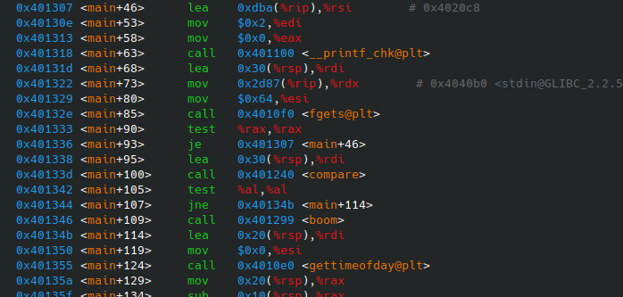

# Estructura de Computadores. Práctica 4.

**Autor:** Pablo Díaz Madera
- **Asignatura:** Estructura de Computadores.
- **Curso Académico:** 2024-25.
- **Grado:** Doble Grado en Ingeniería Informática y Matemáticas.
- **Grupo:** Único.
- **Profesor:** Ignacio Rojas Ruiz.
- **Descripción:** Práctica 4 de EC.
***
Primero, ejecutamos la bomba con `gdb`:
```console
gdb ./2024_PDM
```

Una vez dentro de `gdb`, se debe mostrar el lenguaje ensamblador y el contenido de los registros por lo que escribimos:
```console
layout asm
layout regs
```

Dentro del código, vemos lo siguiente:
<p align="center">
  
</p>
En la imagen vemos que para la comparación que determina si entramos a la función `boom` o no después de escribir la contraseña es la función `compare` con la función `encriptar`. Por ello, la buscamos en el código para ver cómo trabaja.
<p align="center">
  
</p>
